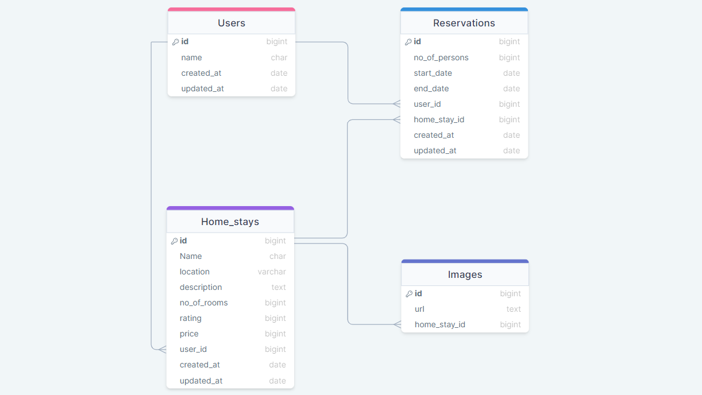

<a name="readme-top" align="center"></a>

<div align="center">
  <h1>STAY A WHILE BACK-END</h1>
  <br/>

</div>

<!-- TABLE OF CONTENTS -->

# 📗 Table of Contents

- [📖 About the Project](#about-project)
  - [🛠 Built With](#built-with)
    - [Tech Stack](#tech-stack)
    - [Key Features](#key-features)
  - [🚀 Live Demo](#live-demo)
  - [🚀 Front-End Link](#front-end)
- [💻 Getting Started](#getting-started)
  - [Setup](#setup)
  - [Prerequisites](#prerequisites)
  - [Install](#install)
  - [Usage](#usage)
  - [Run tests](#run-tests)
  - [Deployment](#triangular_flag_on_post-deployment)
  - [Generate the API documentation](#api-documentation)
- [👥 Authors](#authors)
<!-- - [🔭 Future Features](#future-features) -->
- [🤝 Contributing](#contributing)
- [⭐️ Show your support](#support)
- [🙏 Acknowledgements](#acknowledgements)
- [📝 License](#license)

<!-- PROJECT DESCRIPTION -->

# 🏡STAY A WHILE BACK-END <a name="about-project"></a>
Stay A While Backend holds the BackEnd development source rails api of an app that allows users to reserve an apartment or home.

## 🛠 Built With <a name="built-with"></a>

### Tech Stack <a name="tech-stack"></a>

<details>
  <summary>Server</summary>
  <ul>
    <li><a href="https://www.ruby-lang.org/en/">Ruby</a></li>
  </ul>
</details>

<details>
  <summary>Database</summary>
  <ul>
    <li><a href="https://www.postgresql.org/">PostgreSQL</a></li>
  </ul>
</details>

<details>
  <summary>UML Diagram</summary>
  <ul>
    <li>
      
    </li>
 </ul>
</details>

<!-- Features -->

### Key Features <a name="key-features"></a>
 - JWT Authorization upon login and register
 - Create Home Stays and Reservations
 - Rspec Unit testing


<p align="right">(<a href="#readme-top">back to top</a>)</p>

<!-- LIVE DEMO -->
## 🚀 Live Demo <a name="live-demo"></a>
[Stay-A-While](#)

<p align="right">(<a href="#readme-top">back to top</a>)</p>

## 🚀 Front-End Link <a name="front-end"></a>
[Stay-A-While](https://github.com/asharanjith/stay-a-while-front-end)

<p align="right">(<a href="#readme-top">back to top</a>)</p>

<!-- GETTING STARTED -->

## 💻 Getting Started <a name="getting-started"></a>

To get a local copy up and running, follow these steps.

### Prerequisites
In order to run this project you need:

- To install ruby on your PC. You can read [this](https://rubyinstaller.org/downloads/) documentation on how to do so
- To install postgresql on your PC. You can read [this](https://www.postgresql.org/) documentation on how to do so
- Know how to navigate directories or folders at the CLI.
- Know how to get the URL(https/ssh) of a repository on GitHub.
- You should have a code editor installed, preferably VSCode
- In order to run this project you need:

### Setup
In desired folder or directory in the CLI, run the command:

```sh
git clone git@github.com:asharanjith/stay-a-while-back-end.git
```

Navigate into the cloned folder or repository by running the command:
```sh
cd stay-a-while-back-end
```

If VsCode is your default code editor, run:
```sh
code .
```

Create a file called .env in your root directory with the following content:
```sh
  DB_USERNAME = postgres
  DB_HOST = localhost
  DB_PASSWORD = YOUR-PG-ADMIN-PASSWORD
  DB_PORT = 5432
  
 SECRET_KEY_BASE = ce34cefe688c77669768a17ea676b9054c7a2a541441af6e07bdd636897109b175cfbaf3d5d05d31771940c199719a0f55819228a2125ca387a99d207c9e2a54

```

You are all set up!
### Install

Install this project with:

```sh
 bundle install
``` 
### Usage

To setup the database, run
```sh
rails db:drop db:create db:migrate
```

To run the project, execute the following command:

```sh
ruby bin/rails server
```

### Run tests

To run tests, run the following command:

```sh
  rspec spec spec/[filename.rb]
```

### Generate the API documentation
To generate the API documentation, run the following command:

```sh
  rails rswag:specs:swaggerize
```
- The file database.yml is already configured to use those variables
 ### Deployment

You can deploy this project using:

```sh
http://[::1]:3000
http://127.0.0.1:3000
```  

<p align="right">(<a href="#readme-top">back to top</a>)</p>

<!-- AUTHORS -->

## 👥 Authors <a name="authors"></a>
👤  **Asha S Vijayan**

- GitHub: [@asharanjith](https://github.com/asharanjith)
- Twitter: [@asha_cep](https://twitter.com/asha_cep)
- LinkedIn: [asha-vijayan](www.linkedin.com/in/ashavijayan)

👤 **Emmanuella Adu**

- GitHub: [@elarhadu](https://github.com/elarhadu)
- Twitter: [@elarh\_](https://twitter.com/elarh_)
- LinkedIn: [Emmanuella Adu](https://linkedin.com/in/emmanuella-adu)

👤 **Samuel Kyere**
 - GitHub: [@githubhandle](https://github.com/admirerbrown)
 - Twitter: [@twitterhandle](https://twitter.com/brown_admirer)
 - LinkedIn: [LinkedIn](https://www.linkedin.com/in/samuel-ntow-kyere-5036741b4/)

👤 **Rohit Bhatt**

- GitHub: [@rbhatt1999](https://github.com/rbhatt1999)
- Twitter: [@RohitBhatt](https://twitter.com/Rohit_Bhatt_)
- LinkedIn: [Rohit Bhatt](https://www.linkedin.com/in/rohitbhatt-dev/)


<p align="right">(<a href="#readme-top">back to top</a>)</p>

<!-- FUTURE FEATURES -->

## 🔭 Future Features <a name="future-features"></a>
- Payment integration
- Messaging system
- Reviews and ratings
- Social media integration such as Facebook, Twitter, and Instagram to enable users to share their experiences and promote the properties they have stayed in.
- Integration with third-party services such as Google Maps to provide location-based information and directions to properties.

<p align="right">(<a href="#readme-top">back to top</a>)</p>

<!-- CONTRIBUTING -->

## 🤝 Contributing <a name="contributing"></a>

Contributions, issues, and feature requests are welcome!

Feel free to check the [issues page](https://github.com/asharanjith/stay-a-while-front-end/issues).

<p align="right">(<a href="#readme-top">back to top</a>)</p>

<!-- SUPPORT -->

## ⭐️ Show your support <a name="support"></a>

If you like this project give us a ⭐

<p align="right">(<a href="#readme-top">back to top</a>)</p>

<!-- ACKNOWLEDGEMENTS -->

## 🙏 Acknowledgments <a name="acknowledgements"></a>

We would like to thank [Microverse](https://github.com/microverseinc) for this project inspiration.

<p align="right">(<a href="#readme-top">back to top</a>)</p>

<!-- LICENSE -->

## 📝 License <a name="license"></a>

This project is [MIT](./LICENSE) licensed.


<p align="right">(<a href="#readme-top">back to top</a>)</p>
